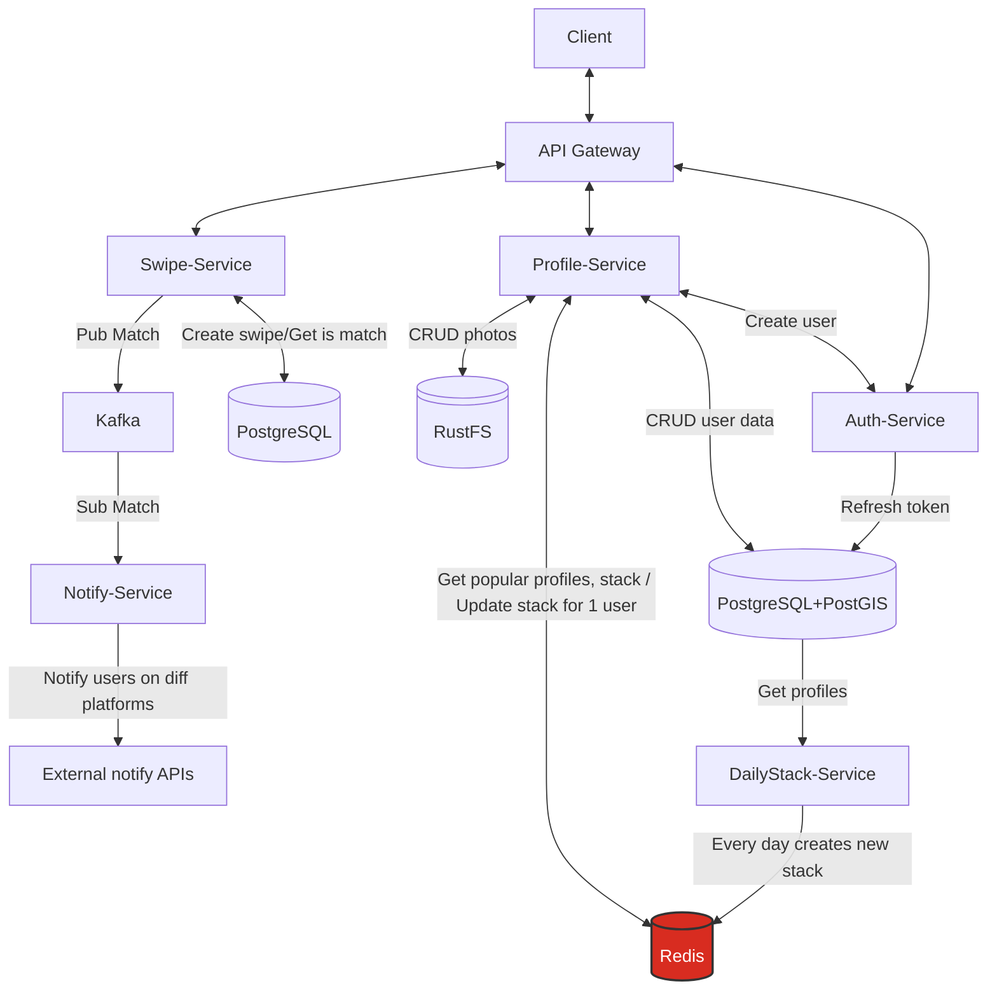
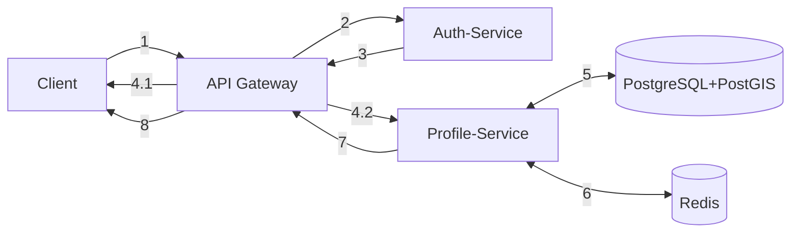
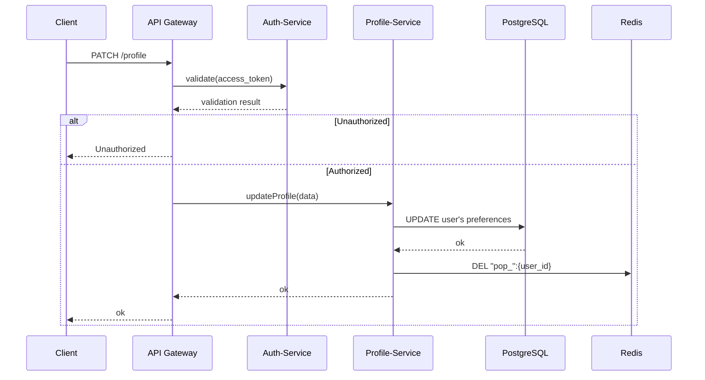
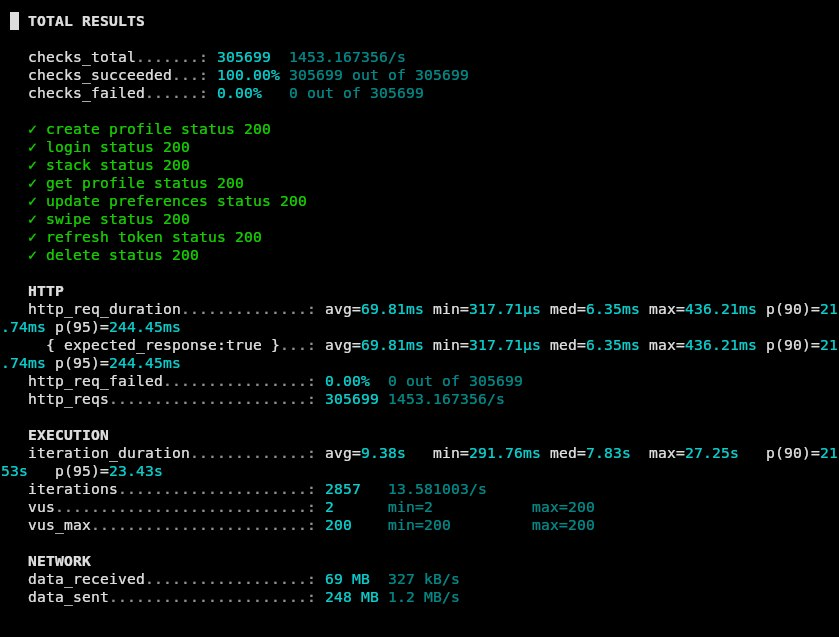

Warning:
Архитектура и workflow на данный момент устаревшие. При разработке было решено преейти на другие решения:
  - Auth service больше не отвечает за Create User - Auth service только работает с jwt: валидация, создание
  - Auth service валидирует токены по gRPC в middleware каждого сервиса, а не через nginx как раньше

## Architecture

## Data structures

### Database tables
#### Profiles
| Field | Type |
|---|---|
| Id | uuid |
| Username | Text |
| Name | Text |
| Surname | Text |
| Email | Text |
| Password | Text |
| Description | Text |
| Latitude | Float |
| Longitude | Float |
| Created_at | TIMESTAMP|

#### JWT_Tokens
| Field | Type |
|---|---|
| Id | PK(profiles.id) |
| refresh_token | Text |

<br>

#### Arts
| Field | Type |
|---|---|
| Id | uuid |
| Author_id | uuid |
| Filename | Text |

<br>

#### Swipes
| Field | Type |
|---|---|
| userId_1 | uuid |
| userId_2 | uuid |
| desicion_1 | bool |
| desicion_2 | bool |


### Kafka topics
matches:
```
{
    "userId_1":{
        platform-data
    }
    "userId_2":{
        platform-data
    }
}
```

### Redis fields

```
Popular profile

Key: "pop_" + $profile_id
Value: user-data - JSON
```


```
User's stack
Key: "stack_" + $profile_id
Value: [ {name, surname, description, geo} ] - ZSET
```

### S3 storage
```
Art-bucket:
filename    UUID
```

## Workflow

### <a href="./docs/workflow-informative.md">Informative workflow graphics</a> <br>
### <a href="./docs/workflow-simple.md">Simple workflow graphics</a>

### For example:
#### Simple graph:

1 - PATCH Запрос от клиента попадает на API Gateway <br>
2 - Валидация по access_token <br>
3 - Возврат результата <br>
4.1 - Unauthorized user <br>
4.2 - Authorized <br>
5 - Обновляем данные профиля в БД <br>
6 - Очищаем кэш "pop_":{user_id} <br>
7-8 - Передаём результат на API Gateway и на Клиент <br>

#### Informative graph:


Нагрузочное тестирование:


<a href="./tests/results.md">Other tests results</a>

For future:
- Add photo 
- Delete photo
