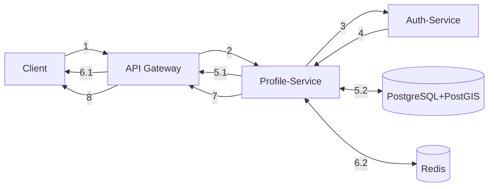
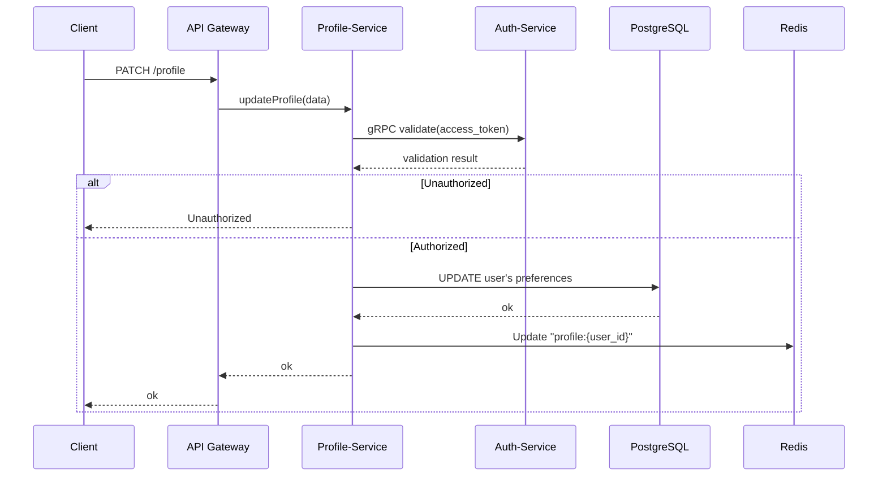

# Matching platform

## Getting Started
### Requirements
- [Docker](https://docs.docker.com/engine)

```bash
git clone https://github.com/isOdin-l/TinderArt && cd TinderArt
docker compose up
```

## Data structures
<a href="./docs/structures.md">Tables, topics, buckets and key names</a>

## Workflow

### <a href="./docs/workflow-informative.md">Informative workflow graphics</a> <br>
### <a href="./docs/workflow-simple.md">Simple workflow graphics</a>

### For example:
#### Simple graph:

1-2 - PATCH Запрос от Клиента на API Gateway, а потом на Profile service <br>
2-4 - Валидация по access_token <br>
5.1-6.1 - Unauthorized user - возврат ответа на Client<br>
5.2 - Authorized; Запрос в БД на изменение данных <br>
6.2 - Кладём новый токен "profile:{user_id}" <br>
7-8 - Передаём результат на API Gateway и на Клиент <br>

#### Informative graph:


## Load Tests

### PC Specs:

HUAWEI MateBook D 16 2024 MCLG-X

CPU: 13th Gen Intel(R) Core(TM) i5-13420H

| Field | Figures |
| --- | --- |
| CPU(s) | 12 |
| Thread(s) per core | 2 |
| Core(s) per socket | 8 |
| Socket(s) | 1 |
| Stepping | 2 |
| CPU(s) scaling MHz | 18% |
| CPU max MHz | 4600.0000 |
| CPU min MHz | 400.0000 |


RAM:
| Field | Value |
| --- | --- |
| Mem type | LPDDR4x |
| Totel mem | 16GB |
| Frequency | 4267 MHz | 


<a href="./tests/results.md">Other tests results</a>
