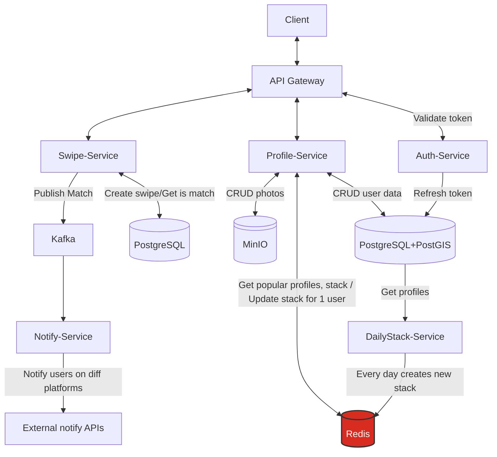

```mermaid
flowchart TB

classDef redis fill:#d82c20,stroke:#333,stroke-width:2px,color:white;


Client["Client"]

Gateway["API Gateway"]

Auth["Auth-Service"]
Profile["Profile-Service"]
Swipe["Swipe-Service"]
Stack["DailyStack-Service"]
Notify["Notify-Service"]
ExternalApis["External notify APIs"]

Cache[("Redis")]:::redis
DB_Profile[("PostgreSQL+PostGIS")]
DB_Swipes[("PostgreSQL")]
S3@{ shape: lin-cyl, label: "MinIO" }
Kafka["Kafka"]

Client <--> Gateway

Gateway <--> Swipe
Gateway <--> Profile
Gateway <--> | Validate token | Auth


Profile <--> | CRUD photos | S3
Profile <--> | CRUD user data| DB_Profile
Profile <--> | Get popular profiles, stack / Update stack for 1 user| Cache

Auth --> | Refresh token | DB_Profile

Swipe --> | Publish Match | Kafka
Swipe <--> | Create swipe/Get is match| DB_Swipes

Kafka --> Notify

DB_Profile --> | Get profiles | Stack
Stack -->| Every day creates new stack | Cache

Notify --> | Notify users on diff platforms | ExternalApis

```