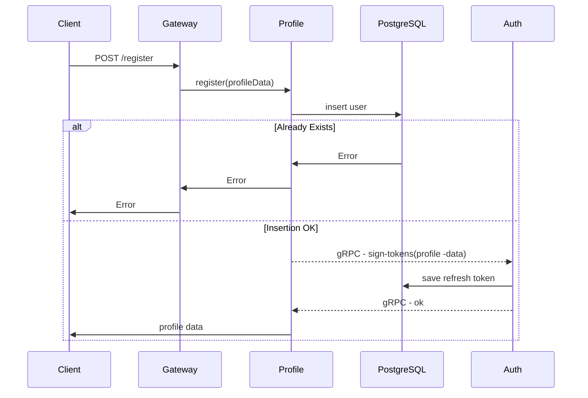
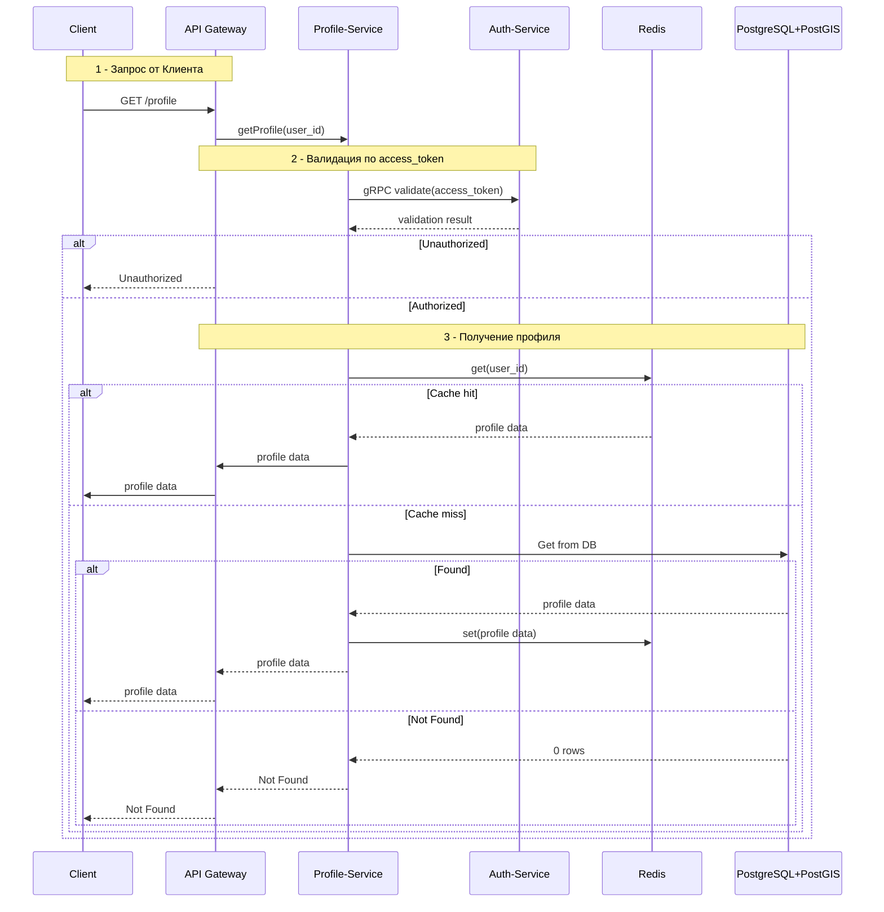
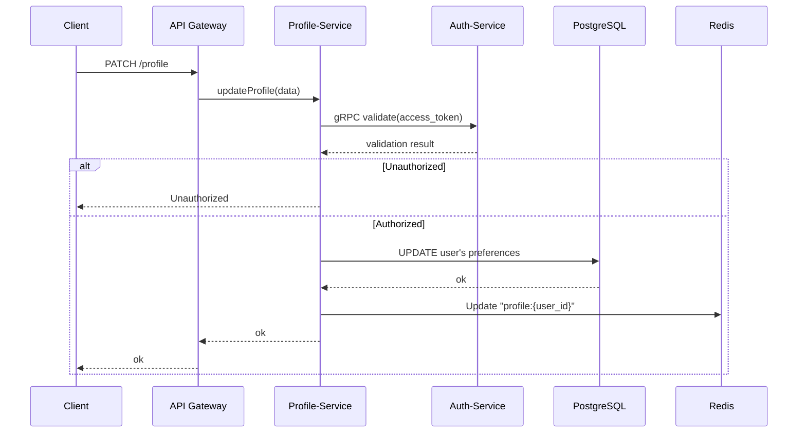
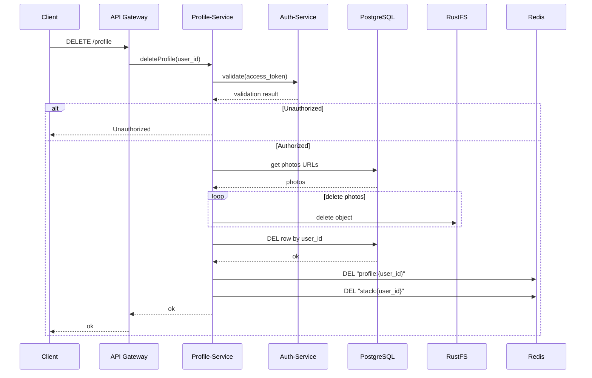
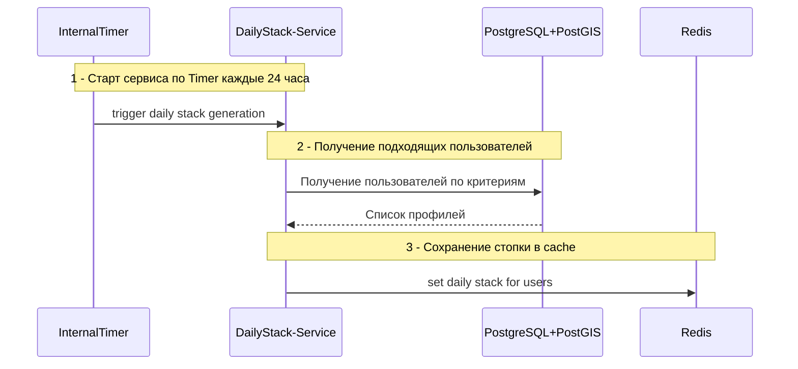
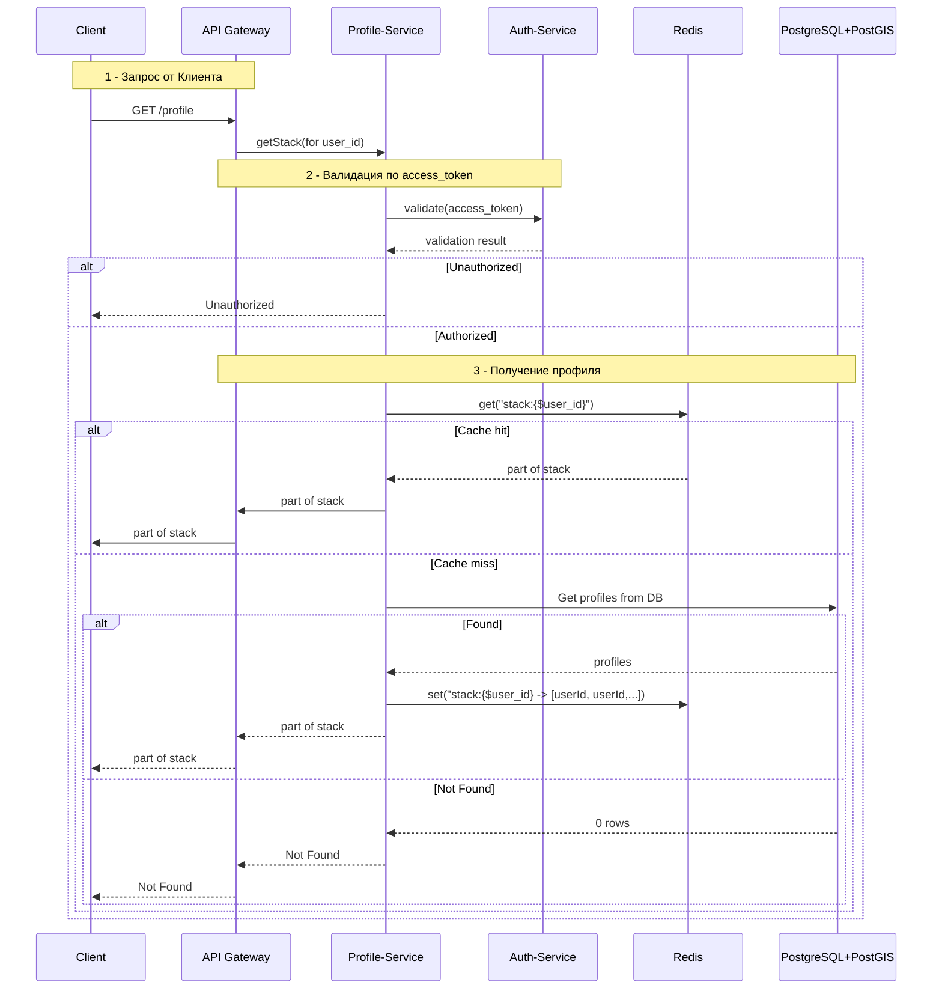
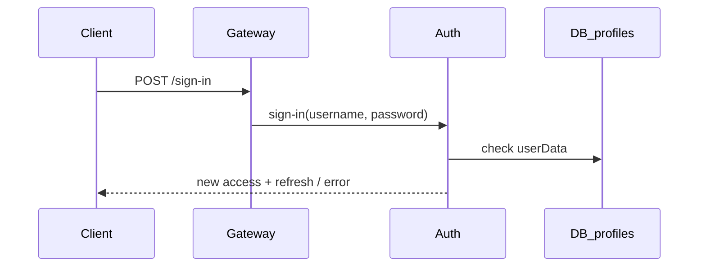
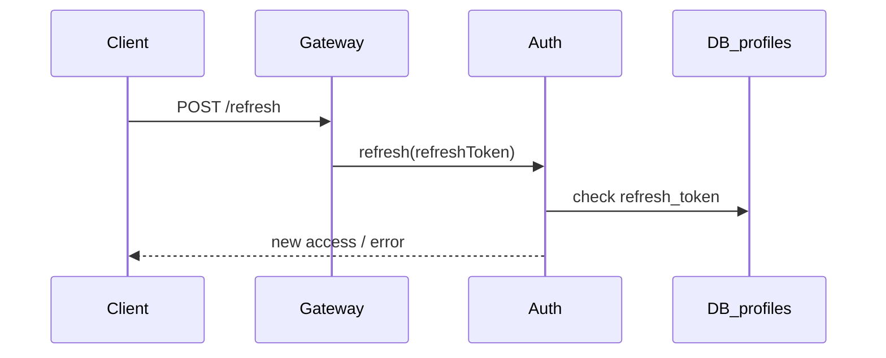
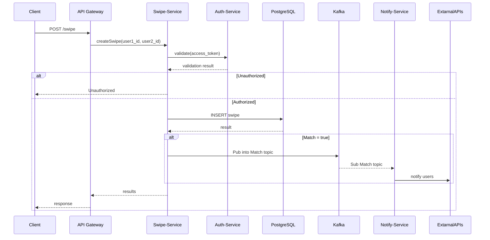

## Create Profile

 

## Get Profile

 

## Update profile

 

## Delete profile

 

## Generate Daily Stack

 

## Get Stack

 

### Sign-in

 

### Refresh access token

 

### Create Swipe

