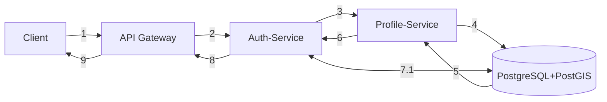
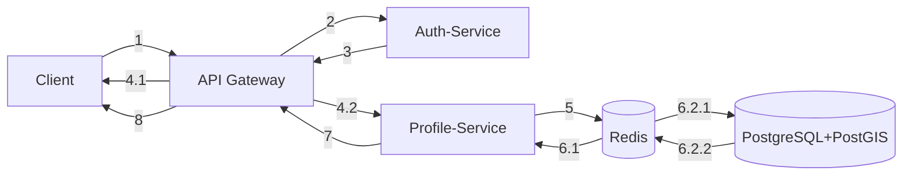
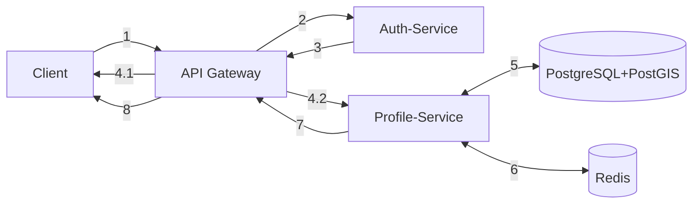
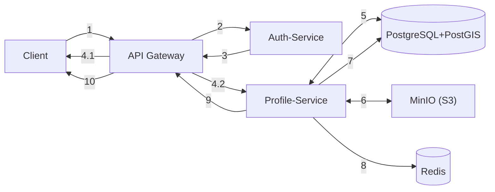
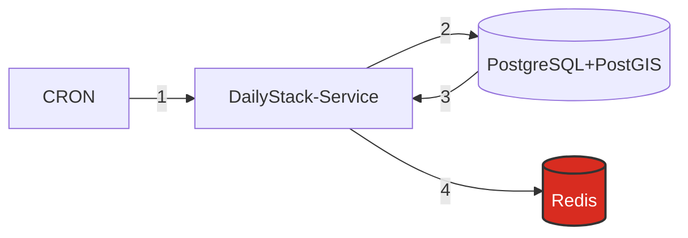
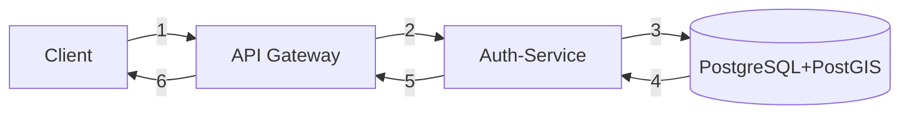
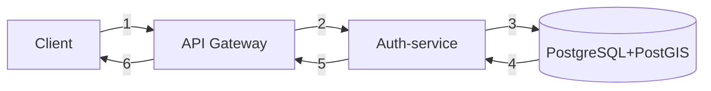
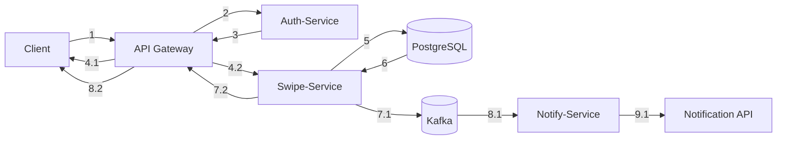

## Create Profile

1 - Запрос от Клиента попадает на API Gateway  
2 - Переадресация на Auth service  
3 - по gRPC преедаём данные пользователя на Profile service 
4 - Создаём запись в БД  
5-6 - Получаем результат и передаём 
7.1 - Если ответ от Profile-service "ok", то делаем запись о refresh_token в БД и получаем ответ  
8-9 - Передаём ответ на API Gateway и на Client  

 

## Get Profile

1 - Запрос от Клиента попадает на API Gateway  
2 - Валидация по access_token  
3 - Возврат результата  
4.1 - Unauthorized user  
4.2 - authorized  
5 - Запрос в Cache для получения профиля  
6.1 - Cache hit  
6.2.1 - Cache miss, поэтому идём в БД за пользователем  
6.2.2 - Кладём профиль в Cache  
7-8 - Передача профиля на API Gateway и на Client  

 

## Update Profile

1 - PATCH Запрос от клиента попадает на API Gateway  
2 - Валидация по access_token  
3 - Возврат результата  
4.1 - Unauthorized user  
4.2 - Authorized  
5 - Обновляем данные профиля в БД  
6 - Очищаем кэш "pop_":{user_id}  
7-8 - Передаём результат на API Gateway и на Клиент  

 

## Delete Profile

1 - Запрос от клиента попадает на API Gateway  
2 - Валидация по access_token  
3 - Возврат результата  
4.1 - Unauthorized user  
4.2 - Authorized  
5 - Получаем из БД список URL фотографий пользователя  
6 - Удаляем фотографии из S3  
7 - Удаляем пользователя из БД  
8 - Удаляем "pop_":{user_id} и "stack_":{user_id} кэш  
9-10 - Передаём результат на API Gateway и на Клиент  

 

## Update preferences

1 - PATCH запрос от клиента идёт на API Gateway  
2 - Валидация по access_token  
3 - Возврат результата  
4.1 - Unauthorized user  
4.2 - Authorized  
5 - Обновляем предпочтения профиля в БД  
6 - Очищаем кэш "stack_":{user_id}  
7-8 - Передаём результат на API Gateway и на Клиент  

 

## Get Stack

1 - Запрос от Клиента попадает на API Gateway  
2 - Валидация по access_token  
3 - Возврат результата  
4.1 - Unauthorized user  
4.2 - authorized  
5 - Запрос в Cache для получения части стопки  
6.1 - Cache hit  
6.2.1 - Cache miss, поэтому идём в БД за стопкой  
6.2.2 - Выдёляем часть стопки для возврата клиенту, а часть кладём большую часть кладём в Cache  
7-8 - Передача части стопки на API Gateway и на Client  

## Generate Daily Stack

1 - Старт сервиса по Cron каждый день  
2-3 - Идём в БД для получения пользователей, которые подходят по критериям  
4 - Отпраляем данные пользователей в Cache

## Sign-in

1) Запрос от клиента на API Gateway
2) Передача на Auth
3) Запрос в БД:
    1) Refresh_token не существует
    2) Пользователь существует
    3) Создание нового refresh_token
4) Получение от БД нового токена либо ошибки
5) Передача на API Gateway
6) Передача на клиент

 

## Refresh access token

1 - Запрос от Клиета на API Gateway  
2 - Передача на Auth  
3-4 - Запрос к БД на существование refresh_token  
5 - Передача нового access_token либо возврат ошибки  
6 - Передача результата на клиент  

 

## Create Swipe

1 - POST запрос от клиента на API Gateway  
2 - Валидация по access_token  
3 - Возврат результата  
4.1 - Unauthorized user  
4.2 - Authorized  
5 - Запись свайпа в БД  
6 - Получение результата: есть ли match  
7.1 - Если match=true: Pub в Kafka "match":{user1: data, user2: data}  
8.1 - Notify service Sub из Kafka  
9.1 - Nofity service отправляет запрос во внешние API для создания уведомления  
7.2-8.2 - Передача части стопки на API Gateway и на Client  