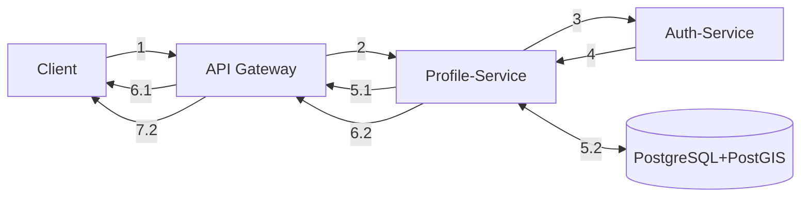
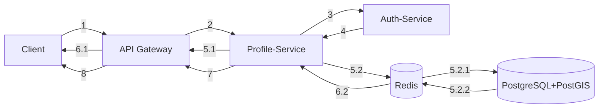
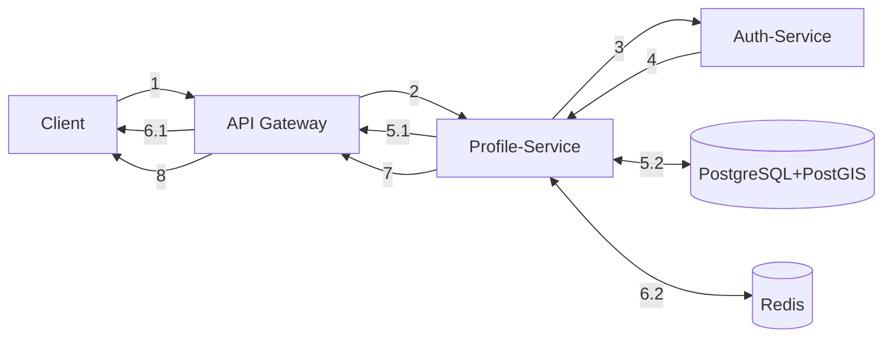
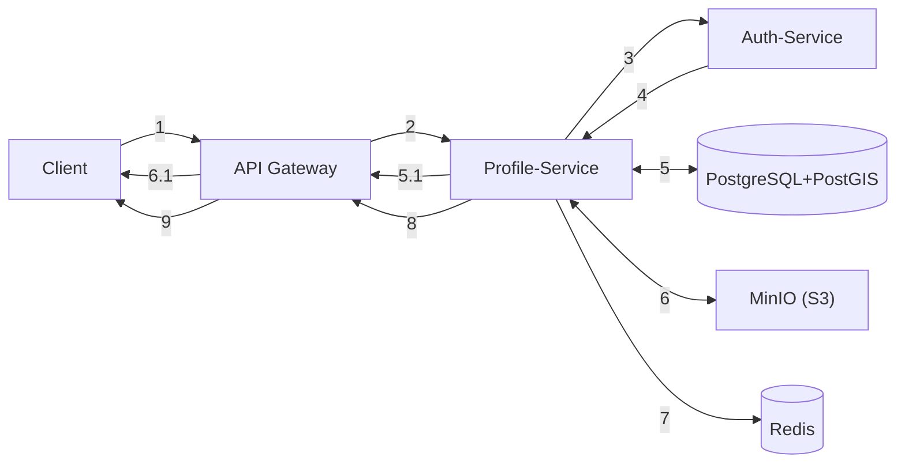
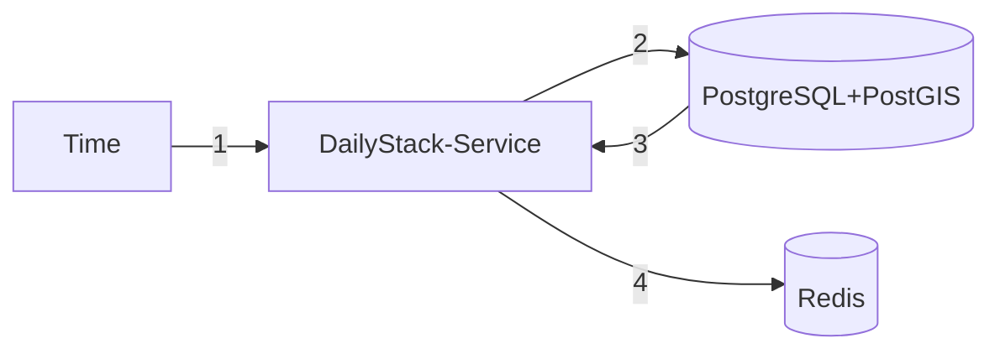
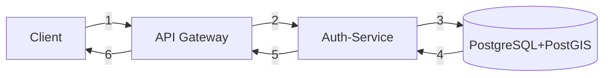
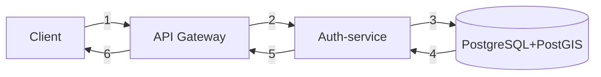
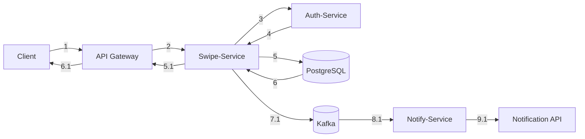

## Create Profile

1 - Запрос от Клиента попадает на API Gateway  
2 - Переадресация на Profile service  
3 - по gRPC преедаём jwt-токены на Auth service для валидации 
4 - Получаем ответ  
5.1-6.1 - Unauthorized 
5.2 - Если ответ от Auth-service "ok", то делаем запись в БД  
6.2-7.2 - Передаём ответ на API Gateway и на Client  

 

## Get Profile

1-2 - Запрос от Клиента на API Gateway, а потом на Profile service  
3-4 - Валидация токена  
5.1-6.1 - Unauthorized user - возврат ответа на Client 
5.2 - Authorized; Запрос в Cache для получения профиля  
6.2 - Получение пользователя  
5.2.1 - Cache miss, поэтому идём в БД за пользователем  
5.2.2 - Кладём профиль в Cache  
7-8 - Передача профиля на API Gateway и на Client  

 

## Update Profile

1-2 - PATCH Запрос от Клиента на API Gateway, а потом на Profile service  
2-4 - Валидация по access_token  
5.1-6.1 - Unauthorized user - возврат ответа на Client 
5.2 - Authorized; Запрос в БД на изменение данных  
6.2 - Кладём новый токен "profile:{user_id}"  
7-8 - Передаём результат на API Gateway и на Клиент  

 

## Delete Profile

1-2 - Запрос от Клиента на API Gateway, а потом на Profile service  
3-4 - Валидация токена  
5.1-6.1 - Unauthorized user - возврат ответа на Client 
5 - Получаем список URL фотографий пользователя и удаляем пользователя из БД 
6 - Удаляем фотографии из S3  
7 - Удаляем "profile:{user_id}" и "stack:{user_id}" кэш  
8-9 - Передаём результат на API Gateway и на Клиент  

 

## Get Stack

1-2 - Запрос от Клиента на API Gateway, а потом на Profile service  
3-4 - Валидация токена  
5.1-6.1 - Unauthorized - возврат ответа на Client 
5 - Authorized; Запрос в Cache для получения части стопки  
6.1 - Cache hit  
6.2.1 - Cache miss, поэтому идём в БД за стопкой  
6.2.2 - Выдёляем часть стопки для возврата клиенту, а часть кладём большую часть кладём в Cache  
7-8 - Передача части стопки на API Gateway и на Client  

## Generate Daily Stack

1 - Запуск задачи по времени (каждые 24 часа) 
2-3 - Идём в БД для получения пользователей, которые подходят по критериям  
4 - Отпраляем данные пользователей в Cache

## Sign-in

1) Запрос от клиента на API Gateway
2) Передача на Auth
3) Запрос в БД:
    1) Refresh_token существует
    2) Пользователь существует
    3) Создание нового refresh_token
4) Получение от БД нового токена либо ошибки
5) Передача на API Gateway
6) Передача на клиент

 

## Refresh access token

1 - Запрос от Клиета на API Gateway  
2 - Передача на Auth  
3-4 - Запрос к БД на существование refresh_token  
5 - Передача нового access_token либо возврат ошибки  
6 - Передача результата на клиент  

 

## Create Swipe

1-2 - Запрос от Клиента на API Gateway, а потом на Swipe service  
3-4 - Валидация токена  
5.1-6.1 - Unauthorized - возврат результата на Client
5 - Authorized; Запись свайпа в БД  
6 - Получение результата: есть ли match  
7.1 - Если match=true: Pub в Kafka "match":{user1:user2}  
8.1 - Notify service Sub из Kafka  
9.1 - Nofity service отправляет запрос во внешние API для создания уведомления  
